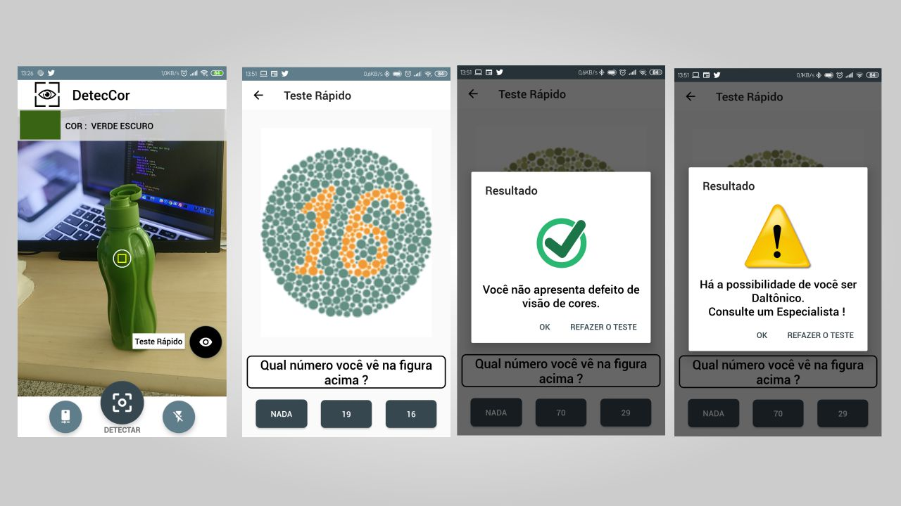

<h1>DetecCor</h1>

DetecCor is a people-oriented color blindness application that detects or recognizes the color of the selected object using the camera of the mobile phone. This mobile app can help the user find colors and shows the color name of the object. In this application, the user can also make a quick test to know if he has any deficiency in perceiving colors (Color Blindness).

DetecCor é um aplicativo voltado para pessoas possuem daltonismo que detecta ou reconhece a cor do objeto selecionado usando a câmera do telefone celular. Este aplicativo para celular pode ajudar o usuário a encontrar cores e mostra o nome da cor do objeto. Nesta aplicação, o usuário também pode fazer um teste rápido para saber ser possui alguma deficiência ao perceber as cores(Daltonismo). 
